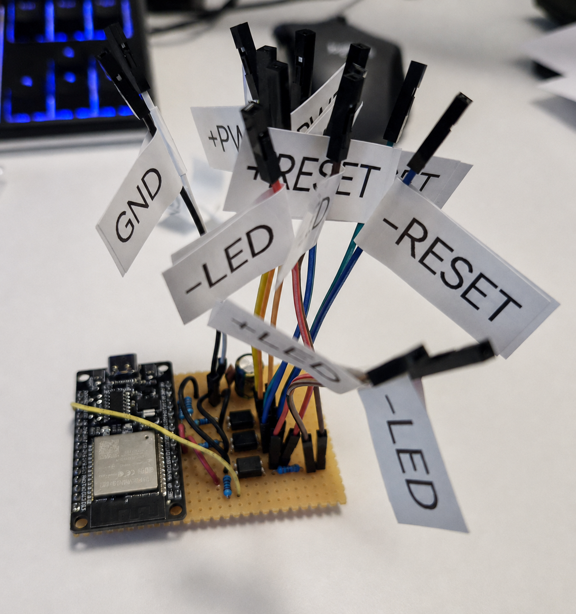
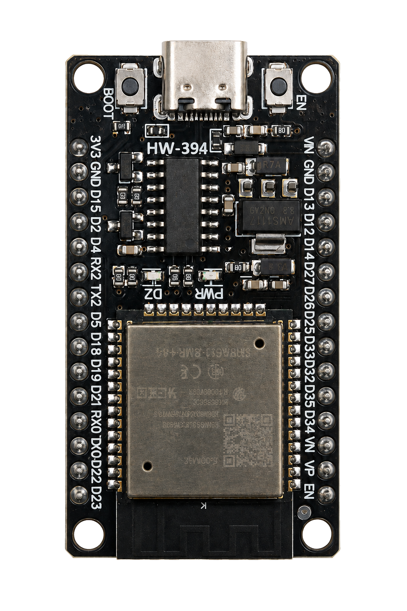

# ESP32 PC Control

Control a PC's POWER and RESET buttons through ESPHome and Home Assistant. Three PC817C optocouplers connect an ESP32 to the motherboard's front panel header: two simulate button presses, and the third reads the power LED signal. The case buttons stay connected and work as usual.

This build uses an **ESP32 HW-394 with USB-C and 30 pins**. It connects to the motherboard's `PWR_SW`, `RESET_SW`, and `PWR_LED` front panel pins. Check your motherboard manual for their locations and polarity.



## Schematic and parts

[](images/schematic.svg)

[KiCad project](kicad/esp32-pc-control/esp32-pc-control.kicad_pro) · [Schematic file](kicad/esp32-pc-control/esp32-pc-control.kicad_sch) · [ESPHome configuration](pc-control.yaml)

<details>
<summary>ESP32 board used in this build</summary>



</details>

| Quantity | Part | Schematic reference |
|---:|---|---|
| 1 | ESP32 HW-394 | — |
| 3 | PC817C, DIP-4 | U1 — POWER, U2 — RESET, U3 — STATUS |
| 2 | 470 Ω resistor | R1, R3 — series resistors for the U1 and U2 inputs |
| 3 | 10 kΩ resistor | R2, R4 — pull-downs; R6 — pull-up |
| 1 | 330 Ω resistor | R5 — series resistor for the U3 input |
| 1 | 100 nF ceramic capacitor | C1 — supply filtering |
| 1 | 220–470 µF electrolytic capacitor, rated for at least 10 V | C2 — supply filtering |
| 1 | Perfboard, 2.54 mm pitch | For assembly |
| As needed | Wire and connectors | Connections to the ESP32 and motherboard |

R2 and R4 hold the control inputs low before the GPIO pins are configured. If a separate RESET connection is not needed, U2/R3/R4 can be omitted; the `PC Reset` button in the software will then have no effect.

## Wiring

| GPIO | Function |
|---|---|
| GPIO27 | POWER through U1 |
| GPIO26 | RESET through U2 |
| GPIO25 | Power LED status through U3 |
| GPIO2 | Built-in blue D2 LED |

GPIO2 is an ESP32 strapping pin, used to select the boot mode. D2 is already connected to it on this HW-394 board; do not add an external pull-up or pull-down.

### PC817C

Top view. The package marking identifies pin 1.

```text
       _______
      |       |
  1   | •     |   4
  2   |       |   3
      |_______|

1 — Anode      4 — Collector
2 — Cathode    3 — Emitter
```

### POWER and RESET

| Connection | POWER — U1 | RESET — U2 |
|---|---|---|
| GPIO → resistor → pin 1 | GPIO27 → R1, 470 Ω | GPIO26 → R3, 470 Ω |
| Pin 2 | ESP32 GND | ESP32 GND |
| Pull-down from GPIO to GND | R2, 10 kΩ | R4, 10 kΩ |
| Pin 4 — collector | PWR_SW signal | RESET_SW signal |
| Pin 3 — emitter | PWR_SW ground | RESET_SW ground |

Each optocoupler connects in parallel with the corresponding case button. Driving the GPIO HIGH turns on the optocoupler and simulates a button press.

### Status from PWR_LED

```text
PWR_LED+ ── R5, 330 Ω ── U3 pin 1
PWR_LED− ──────────────── U3 pin 2

ESP32 3V3 ── R6, 10 kΩ ──┬── GPIO25
                         └── U3 pin 4
ESP32 GND ────────────────── U3 pin 3
```

When PWR_LED is active, U3 pulls GPIO25 to GND. The input uses `inverted: true`, so `PC Power State` reads ON when the PC is on. Both state transitions have a 100 ms filter.

If the motherboard blinks PWR_LED during sleep, the reported state may follow that blinking. The firmware does not detect sleep as a separate state.

## Power supply

The ESP32 must stay powered when the PC is off. Use an always-on USB-C supply, or connect the **ATX +5VSB** standby rail to VIN. A USB port on the PC is suitable only if it remains powered after shutdown.

On a standard 24-pin ATX connector, +5VSB is pin 9, usually the purple wire:

```text
ATX +5VSB ── ESP32 VIN / 5V
ATX GND   ── ESP32 GND
```

This connection is for the development board's VIN input. **Do not connect 5 V to 3V3.**

Connect C1 and C2 in parallel between VIN and GND, close to the ESP32. C2's positive lead goes to VIN and its negative lead to GND. The ceramic C1 has no polarity.

When powered from ATX, the ESP32 and PC share a ground through the power supply. The optocouplers separate the signal paths, but the complete system is not galvanically isolated.

## Controls and indicators

| Button / sensor | Behaviour |
|---|---|
| `PC Power` | Presses POWER for 250 ms. On a running PC, the response depends on the operating system's power button settings. |
| `PC Reset` | Presses RESET for 250 ms. |
| `PC Force Off` | Holds POWER for 4 s to force a shutdown. |
| `PC Power Cycle` | If the PC is on, holds POWER for 4 s, waits up to 10 s for OFF, waits another 2 s, then presses POWER for 250 ms. If the PC is already off, it only sends the short press. |
| `PC Power State` | Reports the state read from PWR_LED. |

`PC Power Cycle` sends the final press even if the wait for OFF times out. Forced shutdown and RESET can lose unsaved work.

The blue D2 LED shows the connection and PC state:

| State | D2 |
|---|---|
| Wi-Fi disconnected | Alternates 250 ms on / 250 ms off |
| Wi-Fi connected, PC on | Steady on |
| Wi-Fi connected, PC off | Flashes for 250 ms every 2 s |

The red PWR LED indicates board power and is not controlled by the firmware.

## Setup and flashing

Install ESPHome first. If you do not already have `secrets.yaml`, create it from the [example file](secrets.yaml.example):

```bash
cp -n secrets.yaml.example secrets.yaml
```

Fill in your Wi-Fi credentials and passwords for OTA, the fallback Wi-Fi network, and the web interface. `secrets.yaml` is excluded from Git by `.gitignore`.

Validate the configuration and flash the firmware:

```bash
esphome config pc-control.yaml
esphome run pc-control.yaml
```

For the first flash, connect the ESP32 over USB and select its serial port, such as `/dev/ttyUSB0` or `/dev/ttyACM0`. Later updates can be sent over Wi-Fi using OTA. To compile without flashing:

```bash
esphome compile pc-control.yaml
```

The web interface is at **http://pc-control.local/**. Log in with the credentials from `secrets.yaml`. If the hostname does not resolve on your network, use the ESP32's IP address. In Home Assistant, add the device through the ESPHome integration.

A fallback network named `PC-Control-Fallback` is configured for Wi-Fi connection problems. Its password is set by `fallback_password`.

The configuration sets `api.reboot_timeout: 0s` so a missing Home Assistant API connection does not trigger a reboot. This does not disable the separate Wi-Fi reboot behaviour.

### If ESPHome cannot find `idf.py`

Environment variables left over from another ESP-IDF installation can interfere with compilation. Clear them in the current terminal and try again:

```bash
unset IDF_PATH
unset IDF_TOOLS_PATH
esphome clean pc-control.yaml
esphome run pc-control.yaml
```

## First run

Before connecting to the motherboard, check the orientation of the optocouplers and C2, check for shorts between supply and ground, and verify that GPIO27/GPIO26 stay LOW during startup.

Once connected, test a short POWER press, then RESET, and check `PC Power State` with the PC both on and off. Finish mounting the controller in the case after these checks.
